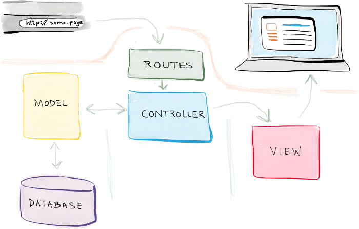

## Stonecold login

>Create a reusable login class taking into consideration most of the possible security threats.

> We will do this using Laravel 🤓 🤓

### Objective
1. Hands on security in PHP(How common vulnerabilities are addressed)
  - Injection
  - Broken Authentication
  - Sensitive Data Exposure
  - XML External Entities
  - Security misconfiguration
  - Cross-Site Scripting
  - Using Components with Known Vulnerabilities
  - Insufficient Logging And Monitoring
2. Laravel 101

### Requirements
- Ubuntu 16.04 LTS
- LEMP / LAMP Stack
- Composer
- Laravel 5.*

#### Installing Ubuntu

Majority of guys are using windows so you will need to choose one of the following options

1. Virtualization
    1. Install VMware Workstation Player
      - [Linux](https://websiteforstudents.com/install-vmware-workstation-player-on-ubuntu-16-04-17-10-18-04-desktop/)
      - [Windows](https://my.vmware.com/en/web/vmware/free#desktop_end_user_computing/vmware_workstation_player/12_0)
    1. [Install Ubuntu on VMware Worstation Player](https://websiteforstudents.com/how-to-install-ubuntu-16-04-17-10-18-04-on-vmware-workstation-guest-machines/)
3. [Dual Boot](https://www.youtube.com/watch?v=qNeJvujdB-0)
3. Cloud Option (DigitalOcean) - Refer to the [Github Student Pack](https://education.github.com/pack) for offer
  - [Create an Ubuntu droplet](https://www.youtube.com/watch?v=irkxCJSOvso)
  - [Secure your droplet : Public/Private Key Auth & Firewall](https://www.digitalocean.com/community/tutorials/initial-server-setup-with-ubuntu-16-04)
  - [Set up HTTPS on your droplet - needs domain name](https://www.digitalocean.com/community/tutorials/how-to-secure-nginx-with-let-s-encrypt-on-ubuntu-16-04) (Bonus 😎 )

#### LEMP / LAMP Stack
- [LEMP - Linux,Nginx,MySQL,PHP](https://www.digitalocean.com/community/tutorials/how-to-install-linux-nginx-mysql-php-lemp-stack-in-ubuntu-16-04)
- [LAMP - Linux,Apache,MySQL,PHP](https://www.digitalocean.com/community/tutorials/how-to-install-linux-apache-mysql-php-lamp-stack-on-ubuntu-16-04)

#### [Install Composer](https://www.digitalocean.com/community/tutorials/how-to-install-and-use-composer-on-ubuntu-16-04)

#### [Install Laravel](https://laravel.com/docs/5.4/installation)

 > NB : Different versions of laravel depend on different PHP versions. Ensure that you install the right one.

 - Laravel 5.2
   - **PHP version between 5.5.9 - 7.1.* **
   - OpenSSL PHP Extension
   - PDO PHP Extension
   - Mbstring PHP Extension
   - Tokenizer PHP Extension
 - Laravel 5.4
    - **PHP >= 5.6.4**
    - OpenSSL PHP Extension
    - PDO PHP Extension
    - Mbstring PHP Extension
    - Tokenizer PHP Extension
    - XML PHP Extension

- Laravel 5.6
    - **PHP >= 7.1.3**
    - OpenSSL PHP Extension
    - PDO PHP Extension
    - Mbstring PHP Extension
    - Tokenizer PHP Extension
    - XML PHP Extension
    - Ctype PHP Extension
    - JSON PHP Extension

##### How do I install PHP extensions? 🤔 🤔

    sudo apt-get install php-VERSION_NAME-EXTENSION_NAME

    e.g.

    sudo apt-get install php-7.0-xml php-7.0-json

##### Install Via Composer Create-Project

    composer create-project --prefer-dist laravel/laravel FOLDER_NAME "LARAVEL_VERSION"

    e.g

    composer create-project --prefer-dist laravel/laravel stonecold "5.4.*"

> NB: Run laravel as a normal apache / nginx app instead of `$php artisan serve`
> Configure a virtualhost for your laravel app
> [Apache](https://gist.github.com/dj1020/e9898200d82ad9a56c84e3cec644b44b) or [Nginx](https://gist.github.com/enginkartal/04d727d361382dc3d41b)

### Stonecold Login 😜 😜 🤡 🤡

#### MVC Design Pattern (Generic)

Laravel applications follow the traditional **Model-View-Controller** design pattern, where you use:

- *Controllers* to handle user requests and retrieve data, by leveraging Models
- *Models* to interact with your database and retrieve your objects’ information
- *Views* to render pages

In addition to this, routes are used to map URLs to designated controller actions.

A simple workflow is as shown below;

[@Source](https://selftaughtcoders.com/from-idea-to-launch/lesson-17/laravel-5-mvc-application-in-10-minutes/)

1. A request is made

    `http://some-laravel-page`
2. The route associated with that URL maps the URL to a controller action.

    `some-page-controller@view`

3. That controller action leverages the necessary model(s) to retrieve information from the database, and then passes that data off to a view.

  `fetch_data from some-page-model`

4. And that view renders the final page.

  `render some-page-view`

> Check this with the default laravel page

> NB : THis is just one of the many juicy features in laravel i.e. it does not explain everything(See Interesting read below) 🤔 🤔

#### [Laravel Directory Structure](https://laravel.com/docs/5.4/structure)

#### Laravel artisan CLI

Artisan is the command-line interface included with Laravel. It provides a number of helpful commands that can assist you while you build your application. To view a list of all available Artisan commands, you may use the list command:

    php artisan list

Some **high level** commands are;

    clear-compiled   Remove the compiled class file
    down  Put the application into maintenance mode
    env  Display the current framework environment
    help  Displays help for a command
    inspire  Display an inspiring quote      list  Lists commands
    migrate  Run the database migrations
    optimize  Optimize the framework for better performance
    serve  Serve the application on the PHP development server
    tinker  Interact with your application
    up  Bring the application out of maintenance mode

#### [(Some) Laravel Security features](http://www.omniceps.com/security-features-laravel-application-security/) 🙂 🙂 

## References
- [Laravel Documentation - Installation](https://laravel.com/docs/5.5/installation)
- [DigitalOcean Tutorials](https://www.digitalocean.com/community/tutorials)
- [OWASP Top 10 -2017 The Ten Most Critical Web Application Security Risks](resources/OWASP_Top_10-2017_en.pdf)
- [Creating a Basic Laravel 5 MVC Application in 10 Minutes](https://selftaughtcoders.com/from-idea-to-launch/lesson-17/laravel-5-mvc-application-in-10-minutes/)
- [Artisan Console](https://laravel.com/docs/5.4/artisan)
- [Interesting read : Why Laravel is NOT an MVC framework and you should forget about MVC](https://www.linkedin.com/pulse/why-laravel-mvc-framework-you-should-forget-kali-dass)

>_"Above all else, guard your affections. For they influence everything else in your life."_ ✍ ✍
